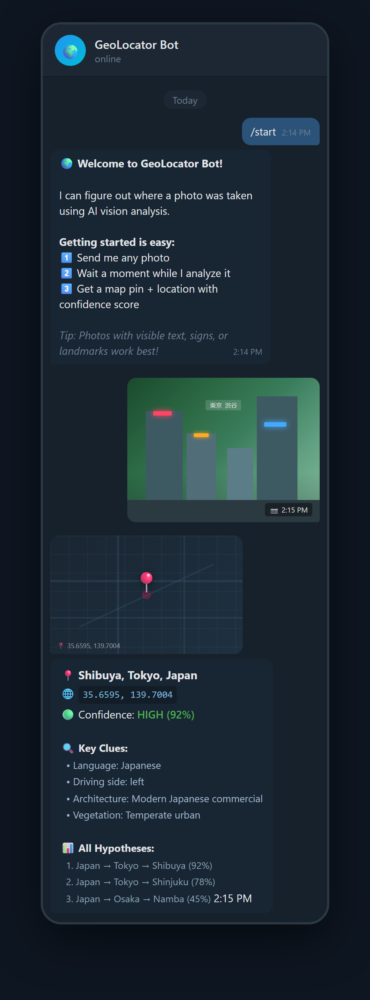
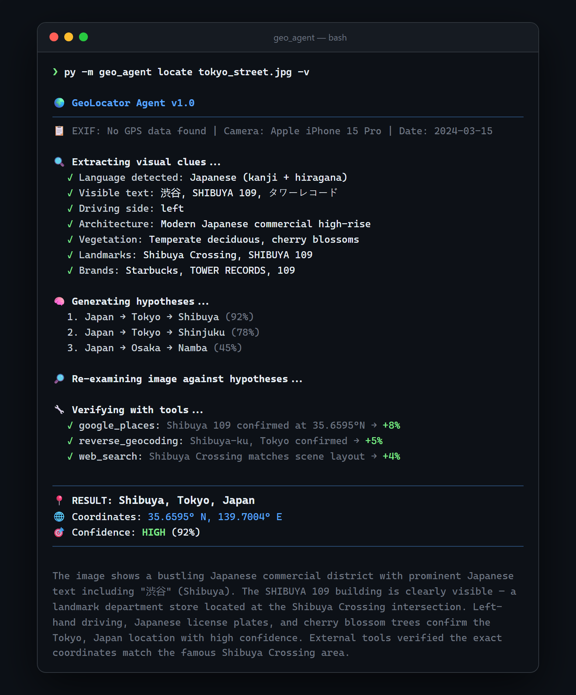
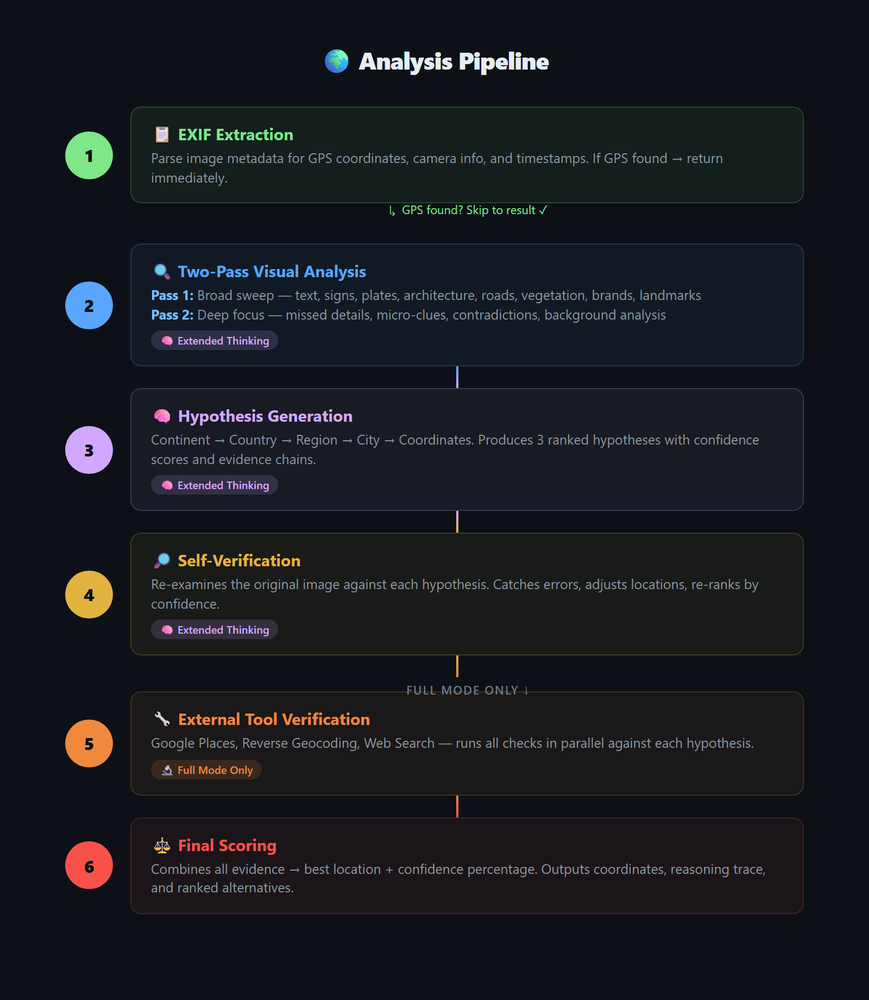

<p align="center">
  <h1 align="center">🌍 GeoAgent</h1>
  <p align="center">
    <strong>AI-powered geolocation agent that figures out where any photo was taken.</strong>
  </p>
  <p align="center">
    Uses Claude's vision + extended thinking to analyze text, signs, architecture, plates, vegetation, and 50+ other clues — then verifies with external tools.
  </p>
  <p align="center">
    <a href="#quick-start">Quick Start</a> &nbsp;·&nbsp;
    <a href="#telegram-bot">Telegram Bot</a> &nbsp;·&nbsp;
    <a href="#cli">CLI</a> &nbsp;·&nbsp;
    <a href="#how-it-works">How It Works</a>
  </p>
</p>

<br>

<p align="center">
  
  &nbsp;&nbsp;&nbsp;&nbsp;
  
</p>

## Highlights

- **6-stage analysis pipeline** — EXIF extraction, two-pass visual analysis, hypothesis generation, self-verification, tool verification, final scoring
- **Extended Thinking on every call** — Claude reasons internally before responding, dramatically improving accuracy on ambiguous images
- **Two-pass visual extraction** — catches background text, reflections, manhole covers, outlet types, and other micro-details the first scan misses
- **Self-verification loop** — re-examines the original image against its own hypotheses, catching errors before they propagate
- **Telegram bot + CLI** — deploy as a Telegram bot or use from the command line
- **Fast & Full modes** — quick vision-only analysis (~15s) or deep verification with Google Maps + web search (~60s)

## Quick Start

### Prerequisites

- Python 3.11+
- [Anthropic API key](https://console.anthropic.com/)
- (Optional) Telegram bot token from [@BotFather](https://t.me/BotFather)

### Install

```bash
git clone https://github.com/Zhaor3/GeoAgent.git
cd GeoAgent
pip install -e .
```

### Configure

```bash
cp .env.example .env
# Edit .env and add your API keys
```

<details>
<summary><strong>All configuration options</strong></summary>

| Variable | Required | Default | Description |
|----------|----------|---------|-------------|
| `ANTHROPIC_API_KEY` | Yes | — | Claude API key |
| `TELEGRAM_BOT_TOKEN` | For bot | — | Telegram bot token from BotFather |
| `GOOGLE_MAPS_API_KEY` | No | — | Enables Places & Geocoding verification |
| `SERPAPI_KEY` | No | — | Enables web search verification |
| `MODEL_HEAVY` | No | `claude-sonnet-4-20250514` | Model for vision analysis & reasoning |
| `MODEL_LIGHT` | No | `claude-haiku-4-5-20251001` | Model for lightweight tasks |
| `THINKING_BUDGET` | No | `10000` | Extended thinking token budget per call |
| `PIPELINE_TIMEOUT` | No | `300` | Max seconds per analysis |
| `RATE_LIMIT_PER_HOUR` | No | `10` | Photo limit per Telegram user per hour |
| `MAX_IMAGE_SIZE` | No | `2048` | Max pixel dimension before resizing |

</details>

## CLI

```bash
# Analyze a local image (full mode with verification)
py -m geo_agent locate photo.jpg

# Fast mode (vision only, no external tools)
py -m geo_agent locate photo.jpg --fast

# Analyze an image from a URL
py -m geo_agent locate --url "https://example.com/photo.jpg"

# JSON output for scripting
py -m geo_agent locate photo.jpg --json

# Verbose reasoning trace
py -m geo_agent locate photo.jpg -v
```

## Telegram Bot

```bash
py -m geo_agent bot
```

Send any photo and get back a map pin + location with confidence score.

| Command | Description |
|---------|-------------|
| `/start` | Welcome message with current settings |
| `/help` | Full command reference |
| `/settings` | View current mode, verbose state, remaining quota |
| `/mode fast` | Vision only — quick results in seconds |
| `/mode full` | Vision + map/web verification — slower but more accurate |
| `/verbose` | Toggle detailed reasoning in results |

### Docker

```bash
docker build -t geoagent .
docker run --env-file .env geoagent
```

## How It Works

GeoAgent runs a **6-stage analysis pipeline** on every image:

<p align="center">
  
</p>

### What It Looks For

| Category | Examples |
|----------|----------|
| **Text & Signage** | Street signs, shop names, billboards, phone numbers, URLs, domain extensions |
| **License Plates** | Characters, format, color, shape, country-specific symbols |
| **Architecture** | Building style, materials, roof type, window frames, era |
| **Infrastructure** | Road markings, sign standards, utility poles, bollards, traffic lights, driving side |
| **Nature** | Plant species, terrain, soil color, climate zone, mountain shapes |
| **Vehicles** | Makes, models, market region, taxi colors, transit branding |
| **Brands** | Chain stores, telecom providers, gas stations, banks |
| **Micro-details** | Manhole covers, electrical outlets, mailbox styles, garbage bins, antenna types |

### Key Design Decisions

<details>
<summary><strong>Why extended thinking?</strong></summary>

Extended Thinking is enabled on every LLM call with a 10k token budget. The model reasons internally before responding, significantly improving accuracy on ambiguous images. This is especially critical for the visual extraction and hypothesis generation stages where the model needs to consider many competing clues.
</details>

<details>
<summary><strong>Why two passes?</strong></summary>

A single extraction pass consistently misses subtle details — background text, reflections in windows, partially obscured signs, and country-specific micro-details like manhole cover patterns and electrical outlet types. The second pass re-examines the image with explicit instructions to find what was missed, check for contradictions, and analyze the far background.
</details>

<details>
<summary><strong>Why self-verification?</strong></summary>

The self-verification stage re-examines the original image against generated hypotheses, acting as a critical reviewer. This catches a common failure mode where the model over-commits to an early hypothesis despite contradicting evidence. The stage can adjust locations, re-rank hypotheses, and flag low-confidence guesses.
</details>

<details>
<summary><strong>Fault tolerance</strong></summary>

Pass 2 and self-verification are best-effort — if they fail, the pipeline continues with available data. Every LLM call retries once on parse failure. The JSON parser handles trailing commas, comments, and markdown fences that LLMs commonly produce.
</details>

## Architecture

```
geo_agent/
├── config.py                 # Settings (loads .env via pydantic-settings)
├── pipeline.py               # 6-stage pipeline orchestrator
├── main.py                   # Typer CLI (locate, bot)
├── extractors/
│   ├── exif.py               # EXIF/GPS metadata extraction (Pillow)
│   └── visual.py             # Two-pass visual analysis (Claude Vision)
├── reasoning/
│   ├── hypotheses.py         # Location hypothesis generation
│   ├── verify.py             # Self-verification against image
│   └── final.py              # Confidence scoring & result assembly
├── tools/
│   ├── base.py               # Abstract VerificationTool interface
│   ├── maps.py               # Google Places + Reverse Geocoding
│   ├── search.py             # Web search (SerpAPI)
│   └── reverse_image.py      # Reverse image search (stub)
├── bot/
│   ├── telegram_bot.py       # Bot setup (polling/webhook)
│   ├── handlers.py           # Command & photo handlers
│   └── formatters.py         # Result → Telegram message formatting
├── models/
│   └── schemas.py            # Pydantic models (GeoResult, Hypothesis, etc.)
└── utils/
    ├── image.py              # Resize, base64 encode, media type detection
    ├── display.py            # Rich CLI output formatting
    └── parse.py              # Robust JSON extraction from LLM responses
```

## License

MIT
